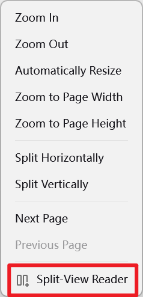
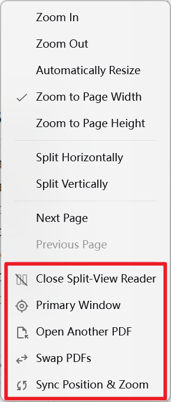
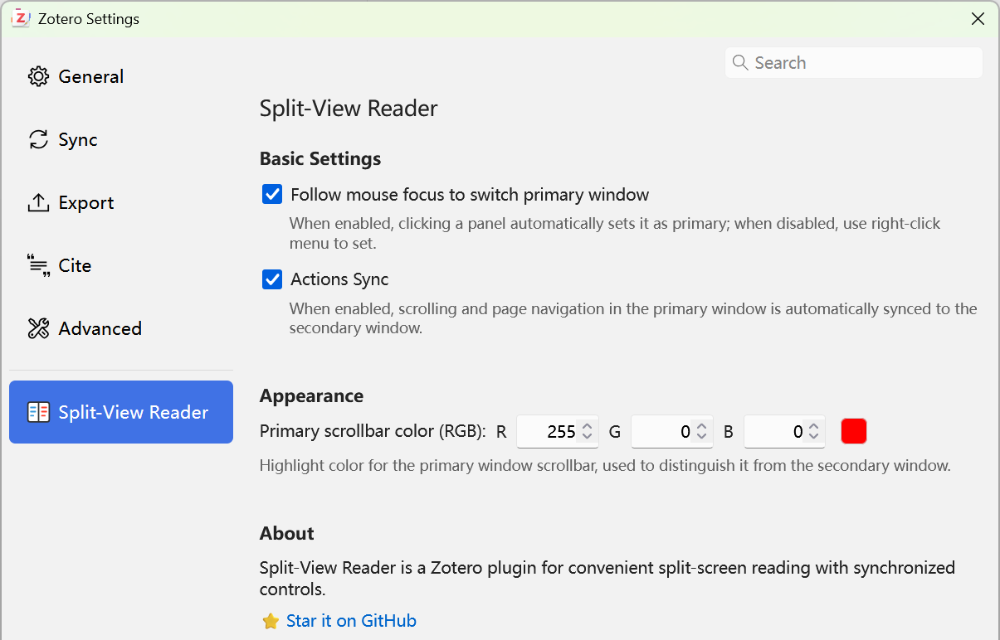

#  Split-View Reader

[English](README.md) | [简体中文](doc/README-zhCN.md)

---

**Split-View Reader** is a plugin for [Zotero 8](https://www.zotero.org/) that enables split-view reading with synchronized controls.

  

## Features

- **Split-View Mode**: View the same PDF document in two synchronized panes side by side
- **Synchronized Scrolling**: Scroll both views simultaneously for seamless reading
- **Independent Navigation**: Each pane can also be navigated independently when needed
- **Seamless Integration**: Works naturally within Zotero's reader interface

## Installation

1. Download the latest `.xpi` file from [Releases](https://github.com/zerolfl/zotero-split-view-reader/releases)
2. In Zotero, go to `Tools` → `Plugins`
3. Click the gear icon and select `Install Plugin From File...`
4. Select the downloaded `.xpi` file

## Usage

### Quick Start with Command Palette

Press `Shift + P` to open Zotero's command palette, then select **Split View Reader** to start split-view mode.

### Right-Click Context Menu

Right-click in either pane to access these options:

| Option | Description |
|--------|-------------|
| **Close Split-View Reader** | Exit split-view mode |
| **Primary Window** | Set current pane as the primary (sync source) |
| **Open Another PDF** | Replace secondary pane with a different PDF |
| **Swap PDFs** | Swap the PDFs between left and right panes |
| **Sync Position & Zoom** | Manually sync position and zoom level |

  
  

### Settings

Go to `Edit` → `Settings` → Click Split-View Reader to configure:

