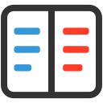
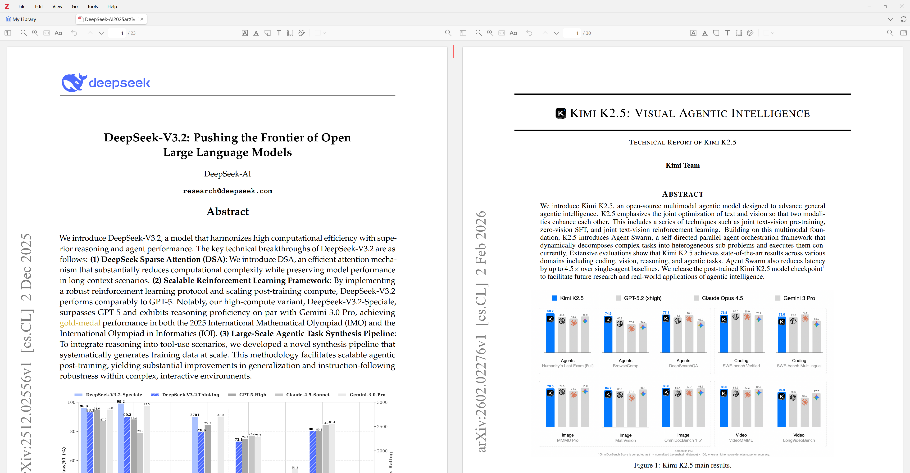
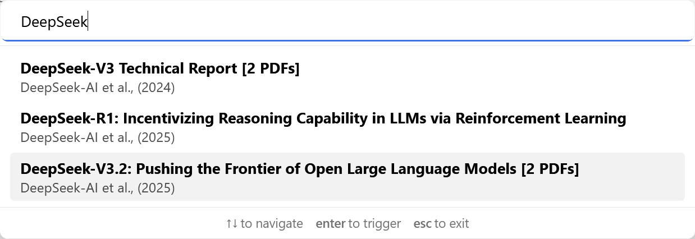
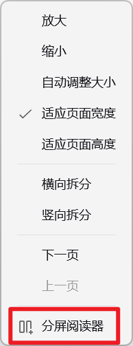
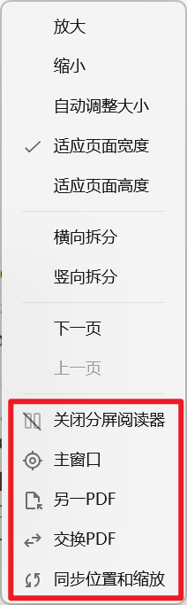
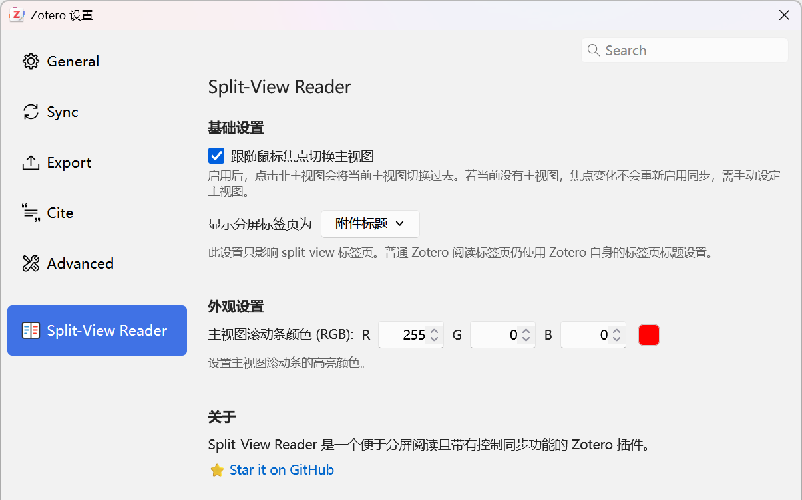

#  Split-View Reader（分屏阅读器）

[English](../README.md) | [简体中文](./README-zhCN.md)

---

**Split-View Reader（分屏阅读器）** 是一款适用于 [Zotero 8](https://www.zotero.org/) 的插件，支持分屏阅读不同的PDF并提供同步控制功能。

  

## 功能特性

- **分屏模式**：在两个并排的窗格中同时查看相同/不同的 PDF 文档
- **同步滚动**：两个视图同步滚动，实现无缝阅读体验
- **独立导航**：需要时，每个窗格也可以独立导航
- **无缝集成**：与 Zotero 阅读器界面自然融合

## 安装方法

1. 从 [Releases](https://github.com/zerolfl/zotero-split-view-reader/releases) 下载最新的 `.xpi` 文件
2. 在 Zotero 中，点击 `工具` → `插件`
3. 点击齿轮图标，选择 `Install Plugin From File...`
4. 选择下载的 `.xpi` 文件

## 使用方法

### 通过命令面板快速启动

按 `Shift + P` 打开 Zotero 命令面板，选择 **分屏阅读器** 即可进入分屏模式。

### 右键菜单操作

在任一窗格中右键点击，可使用以下选项：

| 选项               | 说明                                     |
| ------------------ | ---------------------------------------- |
| **关闭分屏阅读器** | 退出分屏模式                             |
| **拆分视图**       | 将分屏中的阅读器恢复为普通 Zotero 标签页 |
| **主窗口**         | 将当前窗格设为主窗口（同步源）           |
| **另一PDF**        | 在副窗口中打开另一个 PDF                 |
| **交换PDF**        | 交换左右窗格的 PDF                       |
| **同步位置和缩放** | 手动同步位置和缩放级别                   |

  
  

### 设置

点击 `编辑` → `设置` → 点击 Split-View Reader 进行配置：

- **Show Split Tabs as**：选择分屏标签页标题的显示方式，不影响普通 Zotero 标签页
- **跟随鼠标焦点切换主窗口**：焦点变更时自动切换同步源
- **操作同步**：控制滚动与翻页是否保持同步

